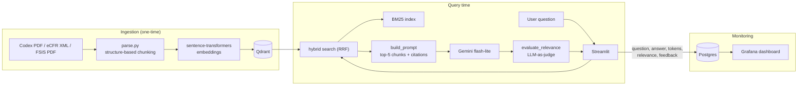

# HACCP Food Safety Compliance RAG

Final project for the [LLM Zoomcamp](https://github.com/DataTalksClub/llm-zoomcamp). A RAG system
that answers HACCP / food safety compliance questions, grounded in the Codex Alimentarius HACCP
principles and FDA/USDA regulatory guidance.

## Problem

Food safety compliance (HACCP — Hazard Analysis and Critical Control Points) is governed by
dense, fragmented regulatory text spread across multiple sources: the Codex Alimentarius general
principles, FDA regulations (21 CFR 120/123), and USDA FSIS guidance. A food safety professional
who needs a specific, citable answer — e.g. "what temperature should poultry be refrigerated at
during distribution?" — has to search across all three, cross-reference section numbers, and trust
their own reading of legal language.

This project is a RAG assistant that answers HACCP compliance questions grounded in that same
regulatory text, with the exact source citation (e.g. `21 CFR 123 § 123.6`, `FSIS HACCP Guidebook,
STEP 2`) attached to every fact it uses — so the answer is verifiable, not just plausible. It
retrieves relevant passages with hybrid search (vector + BM25), answers with an LLM constrained to
that retrieved context, and self-checks the relevance of its own answer before returning it.


## Architecture



Ingestion runs once (`src/ingest.py`) to populate Qdrant. Every question then goes through hybrid
retrieval (`src/rag.py::search`), grounded generation (`build_prompt` + `llm`), and a relevance
self-check (`evaluate_relevance`) before Streamlit shows the answer and logs everything to Postgres
for the Grafana dashboard.

## Stack

- **Data**: Codex Alimentarius (HACCP General Principles, CXC 1-1969) + FDA (21 CFR 120/123) +
  USDA FSIS guidance
- **Embeddings**: sentence-transformers (local)
- **Vector store**: Qdrant
- **LLM**: Gemini API (`gemini-3.5-flash-lite`, OpenAI-compatible endpoint)
- **Interface**: Streamlit
- **Monitoring**: Postgres + Grafana
- **Containerization**: docker-compose

## Retrieval Evaluation

Three retrieval methods were compared on 424 LLM-generated ground truth questions
(hit-rate@5 and MRR@5):

| Method | Hit Rate@5 | MRR@5 |
|---|---|---|
| Vector search | 0.764 | 0.585 |
| BM25 | 0.818 | 0.657 |
| **Hybrid (RRF)** | **0.844** | **0.680** |

Hybrid search (Reciprocal Rank Fusion over vector + BM25 top-20) wins on both
metrics and is the method used in the app. See `src/evaluate_retrieval.py`.

## LLM Evaluation

Both the **prompt** and the **model** were chosen by evaluation, on a fixed sample of 30 ground
truth questions (same questions in every run, fixed random seed).

### Prompt: cited vs plain

Two prompt variants were compared, both on `gemini-3.5-flash-lite`:

- **A (cited)** — instructs the model to cite the source of each fact and to say explicitly when
  the retrieved context does not answer the question
- **B (plain)** — same grounding constraint, without the citation or abstention instruction

| | A (cited) | B (plain) |
|---|---|---|
| RELEVANT (LLM-as-judge) | 29 / 30 | 29 / 30 |
| **Answers citing a source** | **28 / 30 (93%)** | 7 / 30 (23%) |
| Avg response time | 5.36s | 7.45s |
| Avg tokens per question | 1969 | 1860 |

**Relevance alone could not separate the two variants** — identical 29/30. That is a property of
the metric, not a tie in quality: the LLM judge is only asked whether the answer addresses the
question, so it is blind to whether the answer is traceable to a regulation. Adding a second
metric — does the answer actually cite a source? — separates them decisively, 93% vs 23%.

For a compliance assistant that distinction is the whole point: an uncited answer may be correct,
but the user cannot verify it against the regulation. **Variant A is the prompt used in the app.**

### Model: flash-lite vs flash

`gemini-3.5-flash` was evaluated the same way and **could not complete the run** — it exhausted its
free-tier quota partway through the sample even with retry-and-backoff on rate limit errors. Its
answer quality therefore could not be scored, but the result is decisive for a project running on
the free tier: the model is not usable for this workload regardless of how good its answers are.
`gemini-3.5-flash-lite` completed every run, at ~5-7s per question.

See `src/evaluate_llm.py` to reproduce both comparisons.

## Monitoring

Every conversation (question, answer, relevance judgment, token counts, response time) and every
piece of user feedback (👍/👎) is persisted to Postgres by `src/db.py`. A Grafana dashboard,
provisioned automatically on startup — no manual configuration — visualizes it:


| Panel | Type | What it shows |
|---|---|---|
| Relevance distribution | Pie chart | RELEVANT / PARTLY_RELEVANT / NON_RELEVANT split from the LLM-as-judge check on every answer |
| Feedback | Pie chart | 👍 Helpful vs 👎 Not helpful, from the app's feedback buttons |
| Questions per day | Bar chart | Usage over time |
| Response time | Time series | End-to-end latency per question |
| Tokens per question | Time series | Prompt + completion + relevance-eval tokens combined |
| Last 10 conversations | Table | Most recent questions with their relevance and response time |

See `grafana/provisioning/` for the datasource and dashboard definitions (native Grafana
provisioning — no custom scripting).

## Running the project

Requires [uv](https://docs.astral.sh/uv/) and Docker (with `docker compose`).

1. **Clone and install dependencies**
   ```bash
   git clone https://github.com/migueljulve/haccp-compliance-rag.git
   cd haccp-compliance-rag
   uv sync
   ```

2. **Configure environment variables**
   ```bash
   cp .env.example .env
   ```
   Fill in `GEMINI_API_KEY` (free tier: https://aistudio.google.com/apikey). The Postgres/Grafana
   values already have working defaults for local use — only the API key is required.

3. **Start the supporting services**
   ```bash
   docker compose up -d qdrant postgres grafana
   ```

4. **Ingest the corpus into Qdrant** (one-time; raw source documents are already committed under
   `data/raw/`)
   ```bash
   uv run python -m src.ingest
   ```

5. **Run the app**
   ```bash
   uv run streamlit run app/main.py
   ```
   Open the forwarded URL for port `8501` (in GitHub Codespaces: the **Ports** tab in VS Code →
   port `8501` → open in browser; locally: `http://localhost:8501`).

6. **View the monitoring dashboard**: port `3000` the same way, login `admin` / the value of
   `GRAFANA_ADMIN_PASSWORD` in `.env` (default `admin`). Datasource and dashboard are provisioned
   automatically — no manual setup.

**To reproduce the evaluation results** in the sections above:
```bash
uv run python -m src.evaluate_retrieval   # retrieval: vector vs BM25 vs hybrid
uv run python -m src.evaluate_llm         # LLM: gemini-3.5-flash-lite vs gemini-3.5-flash
```

**Fully containerized alternative**: `docker-compose.yml` also defines an `app` service that builds
the Streamlit app into a Docker image (`docker compose up -d --build`) instead of running it with
`uv` on the host. This path has not been exercised in this project's development so far — the
steps above (running `uv run streamlit run app/main.py` directly against the dockerized
Qdrant/Postgres/Grafana) are the verified way to run it.

## Structure

```
data/
  raw/                     # raw source documents (Codex PDF, eCFR XML, FSIS PDF)
  ground_truth.csv         # LLM-generated questions used for retrieval/LLM evaluation
src/
  parse.py                 # chunking: PDF/XML sources -> structured chunks
  ingest.py                # embeds chunks and loads them into Qdrant
  generate_ground_truth.py # generates data/ground_truth.csv with an LLM
  evaluate_retrieval.py    # vector vs BM25 vs hybrid comparison (hit-rate, MRR)
  evaluate_llm.py          # flash-lite vs flash comparison (LLM-as-judge)
  rag.py                   # the RAG pipeline itself: search, build_prompt, llm, rag()
  db.py                    # Postgres persistence for conversations + feedback
app/
  main.py                  # Streamlit interface
grafana/
  provisioning/            # datasource + dashboard, auto-loaded on Grafana startup
docker/
  Dockerfile
docker-compose.yml
```